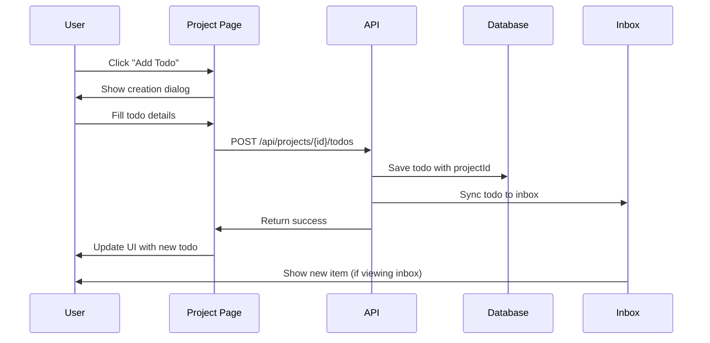

# Creation OS - Interconnected Project Architecture

## Overview
This document outlines the interconnected system architecture for Creation OS, where Intentions, Projects, and Todos are seamlessly connected with automatic sync to the Inbox for unified processing.

## System Architecture

### Data Flow Hierarchy
```
Intentions (High-level goals)
    ↓
Projects (Execution vehicles)
    ↓
Todos (Actionable tasks)
    ↓
Inbox (Processing queue)
```

## Core Components

### 1. Universe Page (`/universe`)
**Purpose**: Top-level dashboard showing intentions and their associated projects

**Key Features**:
- Displays all active intentions with progress tracking
- Shows projects grouped under each intention
- Clickable project cards that navigate to individual project pages
- Real-time progress indicators and momentum tracking
- Activity sparklines and health scores

**Data Sources**:
- `/api/universe/dashboard` - Intention and project overview
- `/api/analytics/today` - Real-time statistics and metrics

### 2. Project Detail Pages (`/projects/[id]`)
**Purpose**: Individual project management with todo creation and tracking

**Key Features**:
- Complete project overview with metrics and activity
- Direct todo creation within project context
- Task clarification workflow with optional questions
- Status management (todo → in_progress → completed)
- Automatic sync to inbox when todos are created

**Data Sources**:
- `/api/projects/[id]` - Project details and metadata
- `/api/projects/[id]/todos` - Project-specific todos
- `/api/inbox/sync` - Inbox synchronization

### 3. Inbox Integration (`/inbox`)
**Purpose**: Unified processing queue for all captured tasks

**Key Features**:
- Automatic addition of project todos to inbox
- AI-powered task analysis and suggestions
- Bulk processing and project assignment
- Source tracking (project, voice note, GitHub issue, etc.)

## Interconnected Workflows

### 1. Todo Creation from Project


### 2. Todo Clarification Workflow
When a todo seems unclear (short title/description), the system triggers clarification questions:

**Questions Asked**:
1. What specific outcome should this task achieve?
2. What are the acceptance criteria?
3. Are there any dependencies or blockers?
4. What resources or tools will you need?

**Benefits**:
- Ensures todos are actionable and well-defined
- Reduces task ambiguity and improves completion rates
- Provides context for future reference and handoffs

### 3. Cross-Component Data Synchronization

**Real-time Updates**:
- Todo creation in project → Updates project metrics
- Todo completion → Updates intention progress
- Status changes → Propagates to all relevant views
- New projects → Updates intention project count

## API Endpoints

### Project Todos
```typescript
// Create todo in project (auto-syncs to inbox)
POST /api/projects/{id}/todos
Body: CreateTodoRequest
Response: CreateTodoResponse

// Get all todos for project
GET /api/projects/{id}/todos?status={status}&priority={priority}
Response: { todos: Todo[] }
```

### Inbox Synchronization
```typescript
// Sync project todo to inbox
POST /api/inbox/sync
Body: { todoId: string, projectId: string, action: 'create' | 'update' | 'delete' }

// Get sync status
GET /api/inbox/sync/status
Response: SyncStatus
```

## Data Types

### Todo Interface
```typescript
interface Todo {
  id: string
  title: string
  description?: string
  status: 'todo' | 'in_progress' | 'completed' | 'blocked'
  priority: 'low' | 'medium' | 'high'
  projectId?: string
  source: 'project' | 'inbox' | 'quick_add' | 'voice_note' | 'github_issue'
  
  // Clarification data
  clarification?: Array<{
    question: string
    answer: string
  }>
  
  // AI metadata
  aiSuggestion?: string
  confidence?: number
  urgencyScore?: number
  aiContext?: string
  
  // Tracking
  createdAt: string
  updatedAt: string
  tags: string[]
}
```

## State Management (Zustand)

### Enhanced Store Actions
```typescript
interface AppState {
  // Enhanced todo actions
  addTaskToProject: (projectId: string, task: Omit<Task, 'id' | 'projectId'>) => void
  addTaskToInbox: (task: Omit<Task, 'id'>) => void
  moveTaskToProject: (taskId: string, projectId: string) => void
  
  // Cross-component sync
  syncToInbox: (todoId: string) => void
  updateProjectMetrics: (projectId: string) => void
  updateIntentionProgress: (intentionId: string) => void
}
```

## User Experience Flow

### 1. From Universe to Todo Creation
1. User views Universe page with intentions
2. Sees projects under each intention
3. Clicks on a specific project
4. Navigates to project detail page
5. Clicks "Add Todo" button
6. Fills out todo creation form
7. If task is unclear, sees clarification questions
8. Submits todo
9. Todo appears in project AND inbox
10. Project metrics update in real-time

### 2. Todo Processing Workflow
1. Todo created in project context
2. Automatically appears in inbox with "project" source
3. AI analysis provides suggestions and context
4. User can process from inbox or manage from project
5. Status changes sync across all views
6. Completion updates project and intention progress

## Benefits of This Architecture

### ✅ **Unified Task Management**
- All tasks flow through inbox regardless of creation source
- Consistent processing workflow for all task types
- No tasks fall through the cracks

### ✅ **Context Preservation**
- Tasks maintain project and intention context
- Clarification data provides detailed context
- Source tracking enables better organization

### ✅ **Real-time Synchronization**
- Changes propagate across all views instantly
- Metrics and progress update automatically
- Consistent state across the entire application

### ✅ **Intelligent Processing**
- AI analysis provides context and suggestions
- Clarification workflow ensures task quality
- Smart prioritization based on urgency scores

### ✅ **Scalable Architecture**
- Easy to add new task sources (GitHub, Slack, etc.)
- Modular design supports feature expansion
- Clean separation of concerns

## Future Enhancements

1. **Smart Task Suggestions**: AI-powered task recommendations based on project context
2. **Dependency Management**: Visual task dependency tracking and automatic blocking
3. **Team Collaboration**: Multi-user project management with assignment and notifications
4. **Integration Hub**: Connect with external tools (GitHub, Jira, Slack, etc.)
5. **Advanced Analytics**: Detailed productivity insights and optimization recommendations

This architecture ensures that Creation OS provides a seamless, intelligent, and scalable task management experience while maintaining the clarity and actionability of all tasks through the interconnected intention → project → todo → inbox workflow.